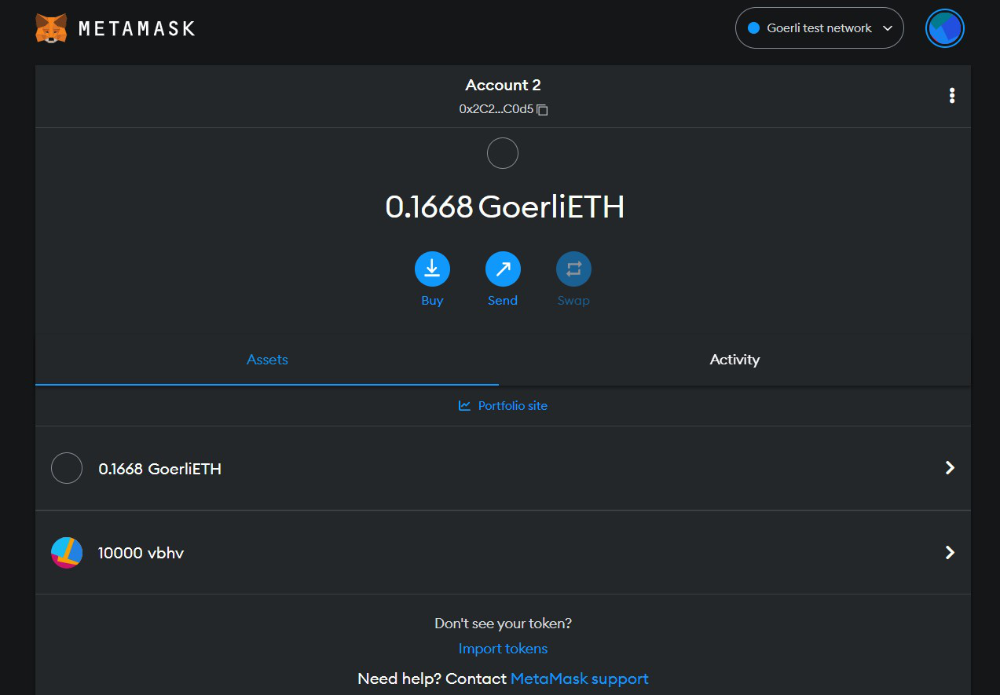

# ERC20_Token
Creating an ERC-20 token involves writing smart contracts in Solidity, a programming language for the Ethereum blockchain. These smart contracts define the rules and behavior of your token, such as its total supply, how it can be transferred, and how it can be used within decentralized applications. You will also need to deploy these contracts to the Ethereum network and distribute your token to interested parties.

It is important to thoroughly test your smart contracts before deploying them to the Ethereum network, as mistakes can result in loss of funds or other unintended consequences. It is also recommended to have a solid understanding of the ERC-20 standard, as well as blockchain and smart contract development, before creating your own token.

